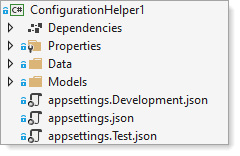
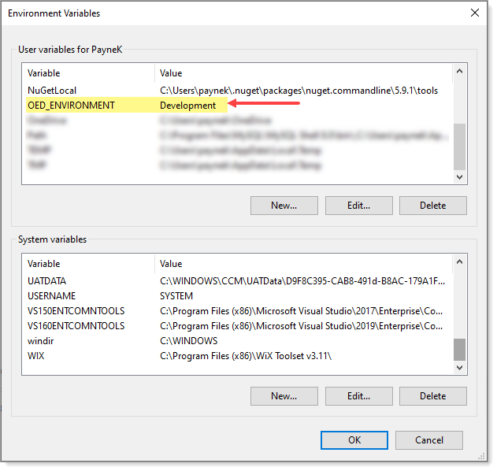

# About

Shows how to have a `appsettings.json` file for a connection string for `production`, `test` and `development` environment for desktop applications similar to ASP.NET Core.

Environment is read from a user environment variable e.g., in this case `OED_ENVIRONMENT`.

Code to read connection string in a DBContext

```csharp
private static string GetConnectionString()
{
    var environment = Environment.GetEnvironmentVariable("OED_ENVIRONMENT");
    
    IConfigurationRoot configuration = new ConfigurationBuilder()
        .AddJsonFile("appsettings.json", optional: false)
        .AddJsonFile($"appsettings.{environment}.json", optional: false)
        .Build();

    return configuration.GetConnectionString("DefaultConnection");
}
```

</br>

```csharp
protected override void OnConfiguring(DbContextOptionsBuilder optionsBuilder)
{
    if (!optionsBuilder.IsConfigured)
    {
        optionsBuilder.UseSqlServer(GetConnectionString());
    }
}
```

One appsettings file for each environment




