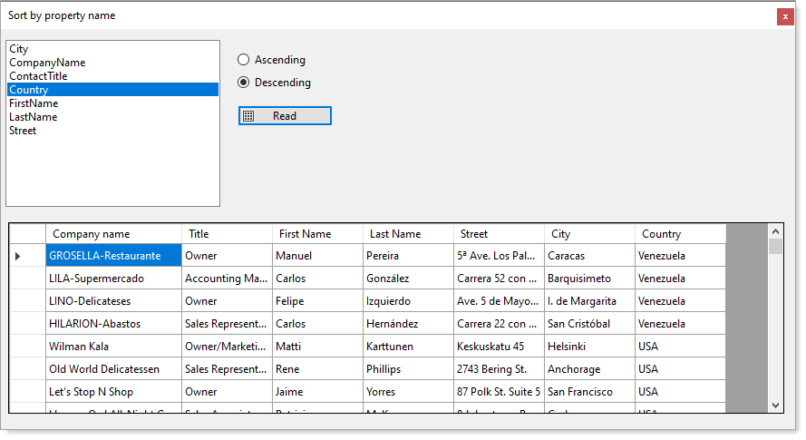

# About

Code demonstrating how to sort a list by property name as a string which provides dynamic, on the fly sorting with ascending or descending order.

> Why use a Windows Form project rather than a unit test?

Because a forms project provides a visual and the ability to change sort by property name and sort direction while in a unit test we need considerable work and this is a quick way to show how to sort on the fly.

**Projection**

:yellow_circle: Some properties for a real app are not present

```csharp
/// <summary>
/// A projection against a specific SELECT statement
/// </summary>
public class CustomerItemSort
{
    public string CompanyName { get; set; }
    public string ContactTitle { get; set; }
    public string FirstName { get; set; }
    public string LastName { get; set; }
    public string Street { get; set; }
    public string City { get; set; }
    public int? CountryIdentifier { get; set; }
    public string Country { get; set; }
    public override string ToString() => CompanyName;

    public static Expression<Func<Customers, CustomerItemSort>> Projection
    {
        get
        {
            return (customers) => new CustomerItemSort()
            {
                CompanyName = customers.CompanyName,
                ContactTitle = customers.ContactTypeIdentifierNavigation.ContactTitle,
                FirstName = customers.Contact.FirstName,
                LastName = customers.Contact.LastName,
                Street = customers.Street, 
                City = customers.City,
                CountryIdentifier = customers.CountryIdentifier,
                Country = customers.CountryIdentifierNavigation.Name,
            };
        }
    }

}
```

**Read method**

```csharp
/// <summary>
/// Custom projection for teaching sorting by property name as a string
/// </summary>
/// <returns>List&lt;<see cref="CustomerItemSort"/>&gt;</returns>
public static async Task<List<CustomerItemSort>> GetCustomersWithProjectionSortAsync()
{

    return await Task.Run(async () =>
    {
        await using var context = new NorthwindContext();
        return await context.Customers
            .Select(CustomerItemSort.Projection)
            .ToListAsync();
    });
}

```

**Sorter code**

:stop_sign: Not beginner or intermediate code

```csharp
public static class Sorters
{
    /// <summary>
    /// Performs a sort by property name as a string on T
    /// </summary>
    /// <typeparam name="T">Type to perform sorting on</typeparam>
    /// <param name="list">List of T</param>
    /// <param name="propertyName">Valid property name in T</param>
    /// <param name="sortDirection">ascending or descending order, ascending is the default direction</param>
    /// <returns>list sorted by property name in specified order</returns>
    public static List<T> SortByPropertyName<T>(this List<T> list, string propertyName, SortDirection sortDirection)
    {

        var param = Expression.Parameter(typeof(T), "item");

        Expression<Func<T, object>> sortExpression = 
            Expression.Lambda<Func<T, object>>(
                Expression.Convert(Expression.Property(param, propertyName), 
                    typeof(object)), param);

        list = sortDirection == SortDirection.Ascending ? 
            list.AsQueryable().OrderBy(sortExpression).ToList() : 
            list.AsQueryable().OrderByDescending(sortExpression).ToList();

        return list;

    }

}

```

