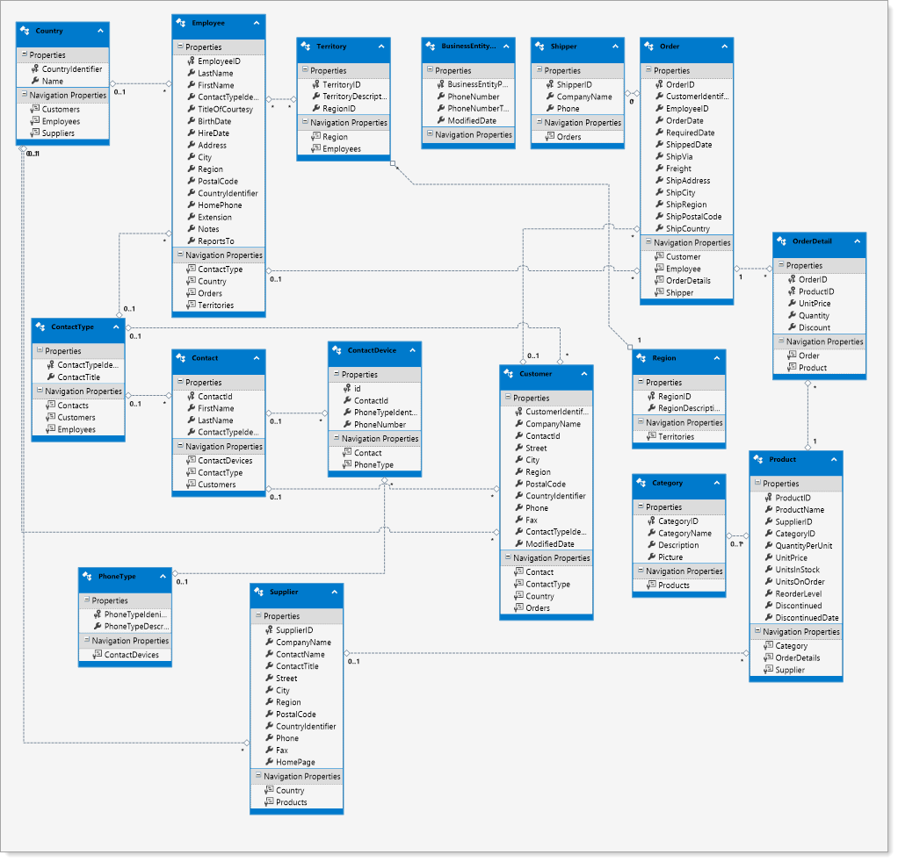

# About

Old school Entity Framework 6 which uses a wizard to generate a DbContext and models. 

At Oregon Department of Revenue the team Karen worked on used .edmx for several ASP.NET projects then went to code first.

- Works but with issues, quirks and constraints
  - With a very large model the T4 generation at times generate bad code where the solution was ugly and a must to have the .edmx under source control
  - Not as flexible as code first while the attraction with T4 is less code to write

